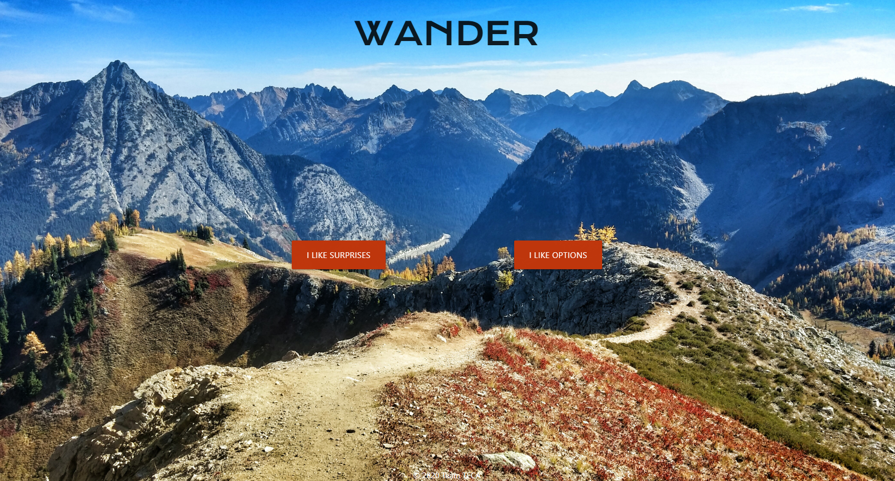

# Wander



Wander is an application that makes choosing a hike easy. We take all the hard work out of choosing a hike


## User Story

```
AS A nature lover
I WANT to go to new and exciting hikes that I'm not familiar with.
SO THAT I can have a good time with no stress.
```

## Acceptance Criteria

```
GIVEN a hiking search engine that's sleek and easy to use.
WHEN I load the page.
THEN I am presented beautiful splash page with simple options. "I like surprises" for a random hike, and "I like options" for a list of hikes.
WHEN I click "I LIKE SURPRISES"
THEN I am presented with information relevant information about a random hike, with a map pointing out where the hike is.
WHEN I click "I LIKE OPTIONS"
THEN I am presented with a list of hike options.
WHEN I click a hike, I am navigated to a page with more details about the hike.

```

## Link to the GitHub Repo
https://github.com/CodySamuels/wander

https://codysamuels.github.io/wander/

## Contributors
https://github.com/AndrewBergstrom

https://github.com/rickyg218

https://github.com/trishness

https://github.com/CodySamuels
